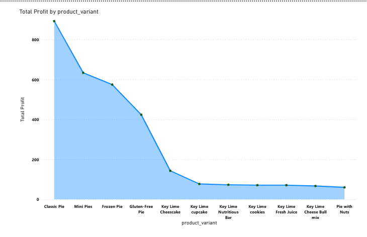
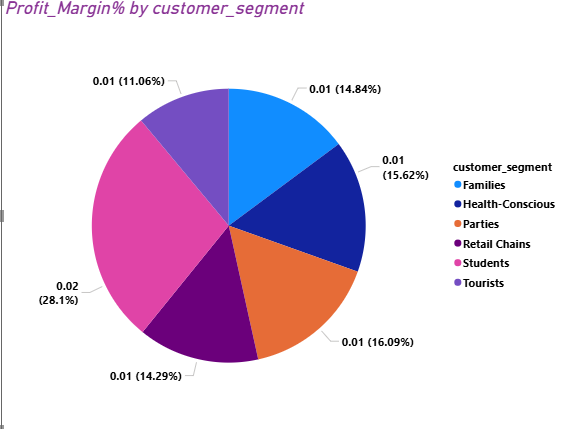
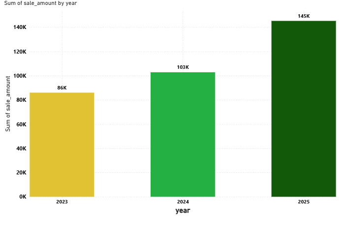
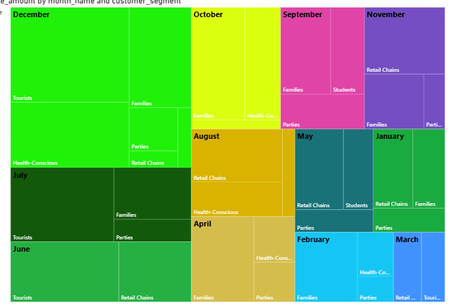
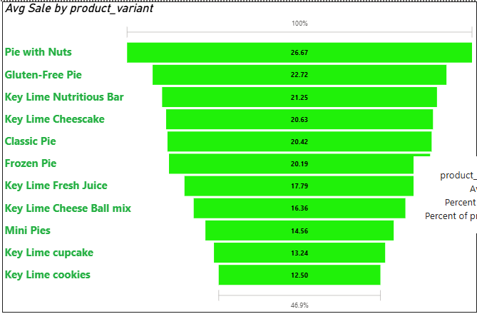

Author: Rucmanidevi Sethu
Key Lime Pie Store – Final Project
A modular, reproducible data analytics pipeline for simulating sales operations at a fictional Key Lime Pie store. This project demonstrates best practices in ETL, schema normalization, and business intelligence workflows using Python, SQLite, and pandas.

📦 Project Overview
This repository contains a complete data pipeline and analytics framework for a mock retail store selling key lime pies and related products. It includes raw and cleaned datasets, a normalized SQLite database, and modular Python scripts for loading, transforming, and analyzing sales data.

1. Business Goals:
-- TO collect raw data and normalize data tinto a star schema
-- Load them into database using Python scripts and analyzing the sales data for the store.
-- Create visualization for the data processed and analyze the sales , profit margin , what went well, what can improve type of questions.

2. Data Source:
The Data is synthetic and added more data manually to have duplicates and missing values. This raw data was saved in the form of CSV files - (customers.csv, sales_fact.csv, key_lime_products.csv)
Later they were processed by running data prep and data scrubber python queries and stored in the processed folder as cleaned versions.
Finally, the data was loaded to the FInal SQLite database - (keylime_sales.db) with normalized schema.

3. Tools used:
   --Python - data cleaning, transformation and  for ETL process.
   --SQLite - Star schema database for analysis
   --Jupyter notebooks- For analysis and visualization
   --VS Code - Developement environment
   --Ruff - Style enforcement
   -- Power BI - Represent data
  4. Workflow & Logic
- Raw Ingestion
Load CSVs from data/raw/ into pandas.
- Cleaning & Normalization
- Remove nulls, duplicates, and trailing spaces
- Align foreign keys and column types
- Normalize into dimension and fact tables
- Schema Design
- Star schema with sales_fact_clean.csv as the central fact table
- Dimensions: customers_clean.csv, key_lime_products_clean.csv
- Database Loading
- Write cleaned tables to keylime_sales.db
- Enforce FK constraints and indexing
- Analysis
- Use notebooks to explore sales trends, customer segments, and product performance

5. (Narrative + Visualizations)
Key findings:
Total Profit by Product

Profit margin by customer segment

Sum of sales by year

Sum of sale by month and customer segment

Avg Sale by Product Variant

Visualizations include:
- I used a Stacked area chart to find the Total Profit by Product- and found that the Class Pie is the Top seller.
- Pie chart of product category distribution- based on this visual Students are the Top contributors to the profit of key lime pie store, next comes Parties and Families who contribute most.
- Heat map gives information on Total sales by Month and  customer segment and see that classic pie has been most commonly purchased all through the year except for March, May, August and November as other products had increased sales on those months.
- Funnel chart of Avg sales by product helps to compare the sales by product and understand the highest and the lowest points.

6. 📈 Suggested Business Action
- Launch targeted summer promotions for top-selling products
- Introduce loyalty rewards for repeat buyers(Students, Party orders and Families)
- Bundle Pie with nuts products with other products to increase average order value
- Expand inventory in the southeast region

7. Challenges
- Schema mismatches between raw and cleaned data
- Inconsistent foreign key formats (string vs integer)
- Missing values and duplicate customer records
- Ensuring reproducibility across environments

8. Ethical Considerations
- All data is synthetic; no real customer information used
- Pipeline design emphasizes transparency and traceability
- Teaching modules encourage responsible data handling
- Future extensions should include bias checks in customer segmentation

🗂 Directory Structure
KEY-LIME-PIE-STORE-FINALPROJECT/
├── .github/              # GitHub workflows and issue templates
├── .ruff_cache/          # Ruff linter cache
├── .venv/                # Python virtual environment
├── .vscode/              # VS Code settings
├── analytics_project/    # Main project scripts and modules
├── data/
│   ├── raw/              # Unprocessed CSVs: customers, products, sales
│   ├── processed/        # Cleaned CSVs for loading into DB
│   └── dw/               # SQLite DB: keylime_sales.db
├── docs/                 # Project documentation
├── notebooks/            # Jupyter notebooks for exploration and teaching
├── src/                  # ETL and normalization logic
└── README.md             # Project overview

🧪 Data Pipeline
- Raw Inputs:
- customers.csv
- key_lime_products.csv
- sales_fact.csv
- Cleaned Outputs:
- customers_clean.csv
- key_lime_products_clean.csv
- sales_fact_clean.csv
- Database:
- keylime_sales.db with normalized star schema

🛠 Technologies Used
- Python (pandas, sqlite3, logging)
- SQLite (star schema design)
- Jupyter Notebooks
- VS Code + Ruff + Pre-commit hooks

🚀 How to Run
- Clone the repo and activate the virtual environment:
git clone https://github.com/your-username/keylime-store.git
cd KEY-LIME-PIE-STORE-FINALPROJECT
source .venv/bin/activate
- Run the ETL pipeline:
python src/etl_pipeline.py
- Explore the database:
- Use notebooks/ for guided analysis
- Connect to data/dw/keylime_sales.db using DB Browser or Python

📊 Teaching & Portfolio Use
This project is designed to be modular and teachable:
- Clean separation of raw vs processed data
- Reproducible pipeline with logging and docstrings
- Schema alignment and normalization logic for BI
- Jupyter notebooks for walkthroughs and demos
